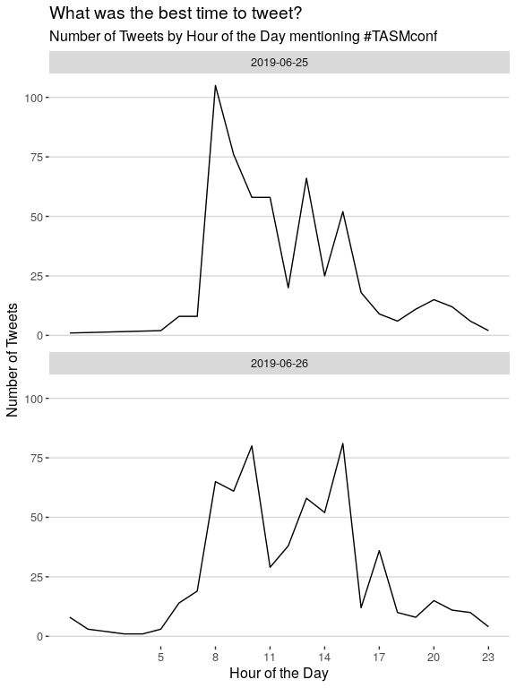
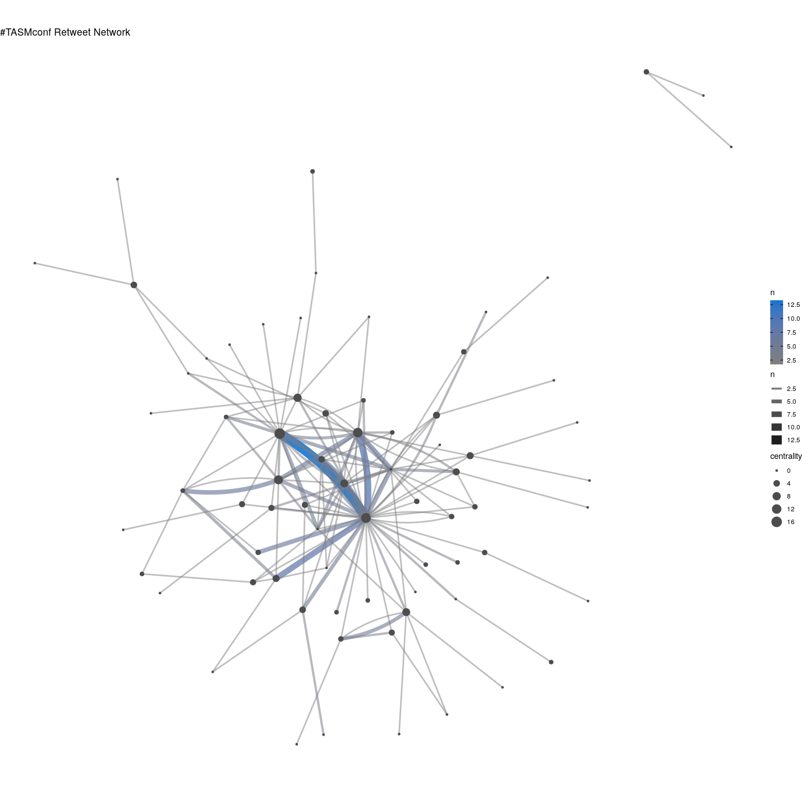
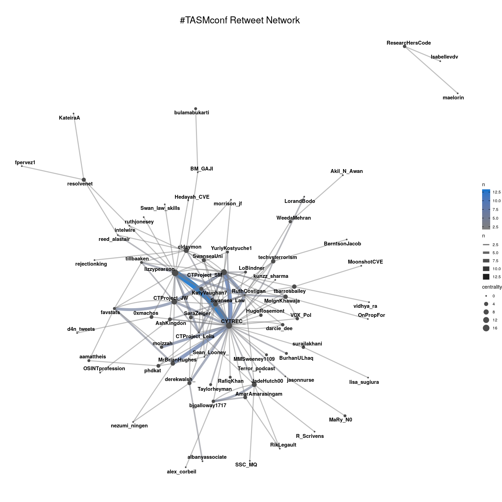
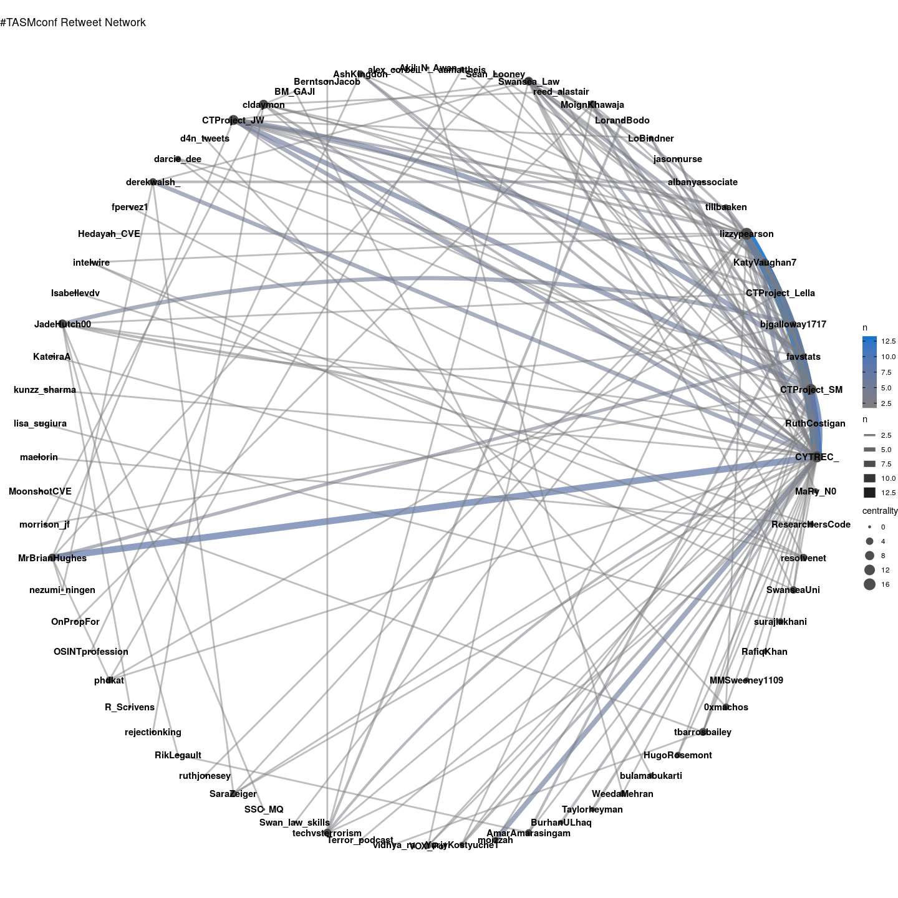
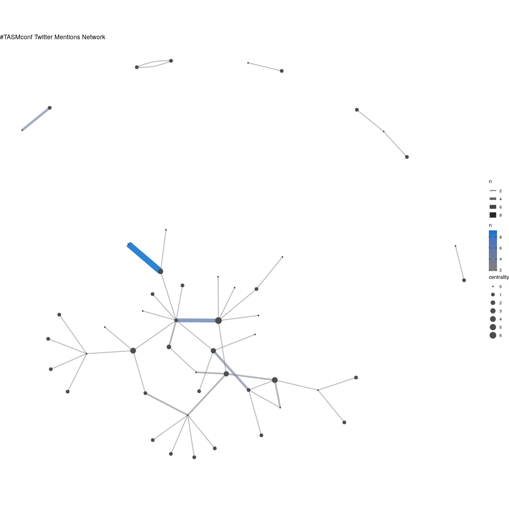
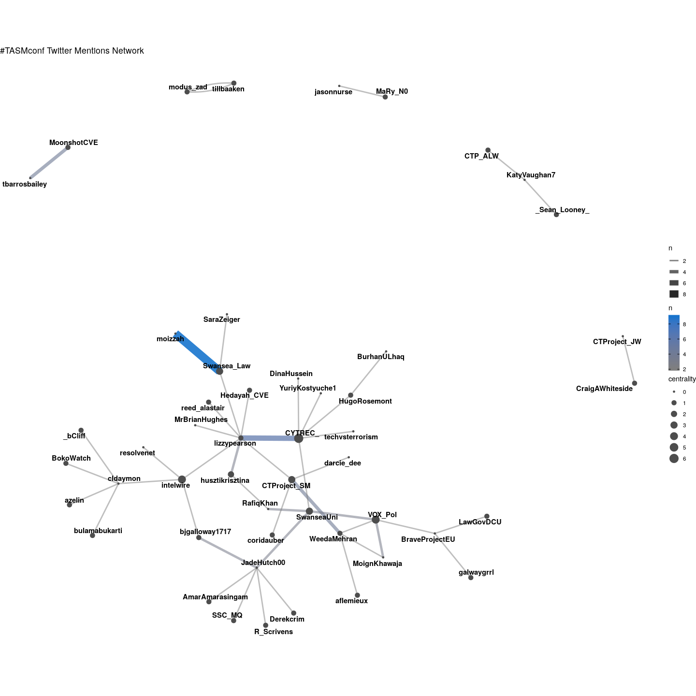
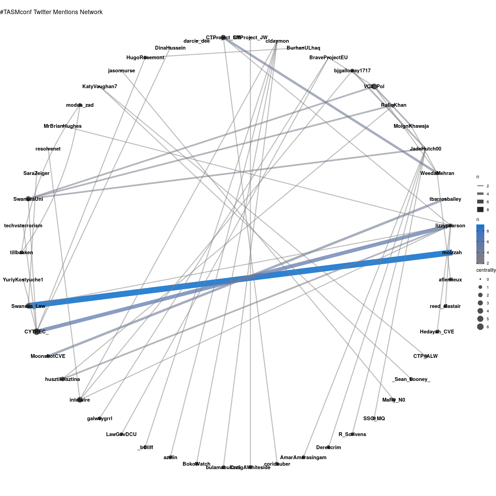
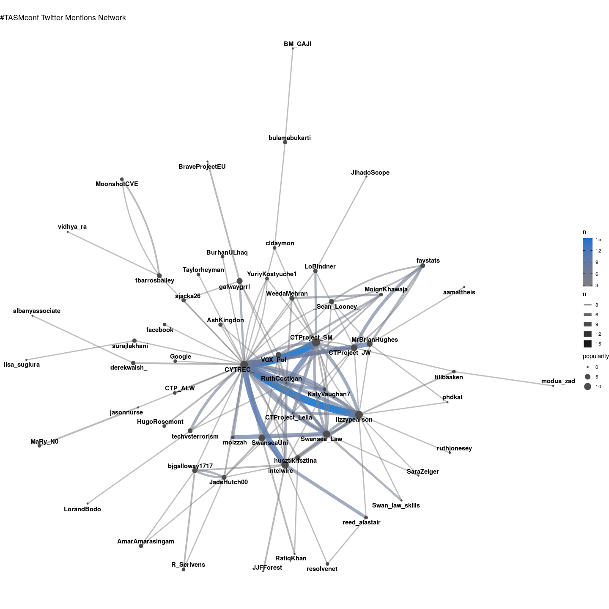
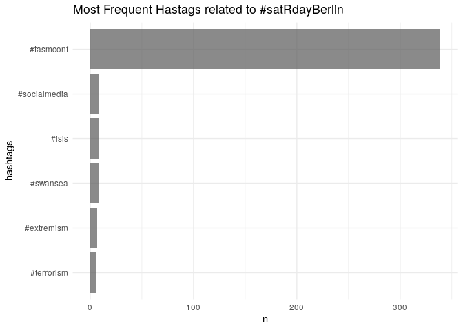
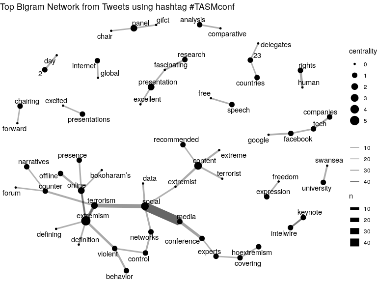

Terrorism and Social Media Conference 2019 Twitter Analysis
================
Fabio
2019-06-28

This is a short notebook outlining the code used to get and analyze tweets on the Terrorism and Social Media conference in Swansea.

Packages
--------

Load the necessary packages

``` r
# install pacman once if not avaible on your machine
# install.packages("pacman")

pacman::p_load(tidyverse, purrr, tidyr, rtweet, stringr, ggraph, igraph, tidygraph, forcats)
```

Get Data
--------

Call Twitter API. If you want to get data yourself you have to register with a free account where you get your personal access point to Twitter. Check out [`rtweet`](https://github.com/mkearney/rtweet/) and follow the instructions.

``` r
twitter_token <- readRDS(".rtweet_token12.rds")

rt <- search_tweets(
  "#tasmconf", n = 5000, include_rts = T, retryonratelimit = T, token = twitter_token
)

save(rt, file = "data/rt.Rdata")
```

Lets first look at the data structure and column names. Twitter returns over 1,200 unique tweets.

``` r
load("data/rt.Rdata")

rt %>% glimpse # the same as str, returns a df overview
```

    ## Observations: 1,344
    ## Variables: 90
    ## $ user_id                 <chr> "3416193065", "3416193065", "3416193065"…
    ## $ status_id               <chr> "1144369871230312448", "1141052196307517…
    ## $ created_at              <dttm> 2019-06-27 22:20:13, 2019-06-18 18:36:5…
    ## $ screen_name             <chr> "aamattheis", "aamattheis", "aamattheis"…
    ## $ text                    <chr> "Yesterday #TASMconf came to an end.  A …
    ## $ source                  <chr> "Twitter for Android", "Twitter for Andr…
    ## $ display_text_width      <dbl> 144, 140, 140, 140, 260, 140, 140, 139, …
    ## $ reply_to_status_id      <chr> NA, NA, NA, NA, NA, NA, NA, NA, NA, NA, …
    ## $ reply_to_user_id        <chr> NA, NA, NA, NA, "88202361", NA, NA, NA, …
    ## $ reply_to_screen_name    <chr> NA, NA, NA, NA, "MrBrianHughes", NA, NA,…
    ## $ is_quote                <lgl> FALSE, FALSE, FALSE, FALSE, FALSE, FALSE…
    ## $ is_retweet              <lgl> TRUE, TRUE, TRUE, TRUE, FALSE, TRUE, TRU…
    ## $ favorite_count          <int> 0, 0, 0, 0, 7, 0, 0, 0, 0, 0, 33, 0, 0, …
    ## $ retweet_count           <int> 1, 13, 5, 2, 1, 4, 5, 8, 1, 2, 13, 2, 0,…
    ## $ quote_count             <int> NA, NA, NA, NA, NA, NA, NA, NA, NA, NA, …
    ## $ reply_count             <int> NA, NA, NA, NA, NA, NA, NA, NA, NA, NA, …
    ## $ hashtags                <list> ["TASMconf", "TASMConf", NA, "TASMConf"…
    ## $ symbols                 <list> [NA, NA, NA, NA, NA, NA, NA, NA, NA, NA…
    ## $ urls_url                <list> [NA, NA, NA, NA, NA, NA, NA, NA, NA, NA…
    ## $ urls_t.co               <list> [NA, NA, NA, NA, NA, NA, NA, NA, NA, NA…
    ## $ urls_expanded_url       <list> [NA, NA, NA, NA, NA, NA, NA, NA, NA, NA…
    ## $ media_url               <list> [NA, NA, NA, NA, "http://pbs.twimg.com/…
    ## $ media_t.co              <list> [NA, NA, NA, NA, "https://t.co/qgZheWqF…
    ## $ media_expanded_url      <list> [NA, NA, NA, NA, "https://twitter.com/a…
    ## $ media_type              <list> [NA, NA, NA, NA, "photo", NA, NA, NA, N…
    ## $ ext_media_url           <list> [NA, NA, NA, NA, <"http://pbs.twimg.com…
    ## $ ext_media_t.co          <list> [NA, NA, NA, NA, <"https://t.co/qgZheWq…
    ## $ ext_media_expanded_url  <list> [NA, NA, NA, NA, <"https://twitter.com/…
    ## $ ext_media_type          <chr> NA, NA, NA, NA, NA, NA, NA, NA, NA, NA, …
    ## $ mentions_user_id        <list> ["513351911", <"1530156212", "47101500"…
    ## $ mentions_screen_name    <list> ["favstats", <"Swansea_Law", "intelwire…
    ## $ lang                    <chr> "en", "en", "en", "en", "en", "en", "en"…
    ## $ quoted_status_id        <chr> NA, NA, NA, NA, NA, NA, NA, NA, NA, NA, …
    ## $ quoted_text             <chr> NA, NA, NA, NA, NA, NA, NA, NA, NA, NA, …
    ## $ quoted_created_at       <dttm> NA, NA, NA, NA, NA, NA, NA, NA, NA, NA,…
    ## $ quoted_source           <chr> NA, NA, NA, NA, NA, NA, NA, NA, NA, NA, …
    ## $ quoted_favorite_count   <int> NA, NA, NA, NA, NA, NA, NA, NA, NA, NA, …
    ## $ quoted_retweet_count    <int> NA, NA, NA, NA, NA, NA, NA, NA, NA, NA, …
    ## $ quoted_user_id          <chr> NA, NA, NA, NA, NA, NA, NA, NA, NA, NA, …
    ## $ quoted_screen_name      <chr> NA, NA, NA, NA, NA, NA, NA, NA, NA, NA, …
    ## $ quoted_name             <chr> NA, NA, NA, NA, NA, NA, NA, NA, NA, NA, …
    ## $ quoted_followers_count  <int> NA, NA, NA, NA, NA, NA, NA, NA, NA, NA, …
    ## $ quoted_friends_count    <int> NA, NA, NA, NA, NA, NA, NA, NA, NA, NA, …
    ## $ quoted_statuses_count   <int> NA, NA, NA, NA, NA, NA, NA, NA, NA, NA, …
    ## $ quoted_location         <chr> NA, NA, NA, NA, NA, NA, NA, NA, NA, NA, …
    ## $ quoted_description      <chr> NA, NA, NA, NA, NA, NA, NA, NA, NA, NA, …
    ## $ quoted_verified         <lgl> NA, NA, NA, NA, NA, NA, NA, NA, NA, NA, …
    ## $ retweet_status_id       <chr> "1144368816740347906", "1140987784053895…
    ## $ retweet_text            <chr> "Yesterday #TASMconf came to an end.  A …
    ## $ retweet_created_at      <dttm> 2019-06-27 22:16:01, 2019-06-18 14:21:0…
    ## $ retweet_source          <chr> "Twitter Web Client", "Twitter Web Clien…
    ## $ retweet_favorite_count  <int> 1, 8, 7, 7, NA, 3, 4, 14, 3, 3, NA, 6, N…
    ## $ retweet_retweet_count   <int> 1, 13, 5, 2, NA, 4, 5, 8, 1, 2, NA, 2, N…
    ## $ retweet_user_id         <chr> "513351911", "1530156212", "950453084", …
    ## $ retweet_screen_name     <chr> "favstats", "Swansea_Law", "CYTREC_", "a…
    ## $ retweet_name            <chr> "Fabio Votta📊🦉", "Swansea Law", "CYTREC"…
    ## $ retweet_followers_count <int> 1961, 1839, 3051, 321, NA, 106, 2161, 23…
    ## $ retweet_friends_count   <int> 5001, 748, 292, 574, NA, 233, 451, 1465,…
    ## $ retweet_statuses_count  <int> 3586, 3616, 3193, 2065, NA, 90, 6459, 87…
    ## $ retweet_location        <chr> "Stuttgart, Deutschland", "Swansea, Wale…
    ## $ retweet_description     <chr> "Political Data Scientist | Uni Stuttgar…
    ## $ retweet_verified        <lgl> FALSE, FALSE, FALSE, FALSE, NA, FALSE, F…
    ## $ place_url               <chr> NA, NA, NA, NA, NA, NA, NA, NA, NA, NA, …
    ## $ place_name              <chr> NA, NA, NA, NA, NA, NA, NA, NA, NA, NA, …
    ## $ place_full_name         <chr> NA, NA, NA, NA, NA, NA, NA, NA, NA, NA, …
    ## $ place_type              <chr> NA, NA, NA, NA, NA, NA, NA, NA, NA, NA, …
    ## $ country                 <chr> NA, NA, NA, NA, NA, NA, NA, NA, NA, NA, …
    ## $ country_code            <chr> NA, NA, NA, NA, NA, NA, NA, NA, NA, NA, …
    ## $ geo_coords              <list> [<NA, NA>, <NA, NA>, <NA, NA>, <NA, NA>…
    ## $ coords_coords           <list> [<NA, NA>, <NA, NA>, <NA, NA>, <NA, NA>…
    ## $ bbox_coords             <list> [<NA, NA, NA, NA, NA, NA, NA, NA>, <NA,…
    ## $ status_url              <chr> "https://twitter.com/aamattheis/status/1…
    ## $ name                    <chr> "Ashley Mattheis", "Ashley Mattheis", "A…
    ## $ location                <chr> "Durham, NC", "Durham, NC", "Durham, NC"…
    ## $ description             <chr> "PhD. Candidate in Communication. Femini…
    ## $ url                     <chr> NA, NA, NA, NA, NA, NA, NA, NA, NA, NA, …
    ## $ protected               <lgl> FALSE, FALSE, FALSE, FALSE, FALSE, FALSE…
    ## $ followers_count         <int> 386, 386, 386, 386, 386, 386, 386, 386, …
    ## $ friends_count           <int> 783, 783, 783, 783, 783, 783, 783, 783, …
    ## $ listed_count            <int> 4, 4, 4, 4, 4, 4, 4, 4, 4, 4, 4, 4, 0, 0…
    ## $ statuses_count          <int> 1330, 1330, 1330, 1330, 1330, 1330, 1330…
    ## $ favourites_count        <int> 4712, 4712, 4712, 4712, 4712, 4712, 4712…
    ## $ account_created_at      <dttm> 2015-08-11 21:03:58, 2015-08-11 21:03:5…
    ## $ verified                <lgl> FALSE, FALSE, FALSE, FALSE, FALSE, FALSE…
    ## $ profile_url             <chr> NA, NA, NA, NA, NA, NA, NA, NA, NA, NA, …
    ## $ profile_expanded_url    <chr> NA, NA, NA, NA, NA, NA, NA, NA, NA, NA, …
    ## $ account_lang            <chr> "en", "en", "en", "en", "en", "en", "en"…
    ## $ profile_banner_url      <chr> "https://pbs.twimg.com/profile_banners/3…
    ## $ profile_background_url  <chr> "http://abs.twimg.com/images/themes/them…
    ## $ profile_image_url       <chr> "http://pbs.twimg.com/profile_images/631…

The top ten liked tweets.

``` r
# load("rt.Rdata")
rt %>% 
  filter(!is_retweet) %>% 
  select(screen_name, text, favorite_count) %>% 
  filter(!str_detect(text, "^RT")) %>% 
  mutate(text = str_replace_all(text, "\\\n", " ")) %>% 
  arrange(desc(favorite_count)) %>% 
  top_n(n = 10) %>% 
  knitr::kable(., format = "markdown")
```

<table>
<colgroup>
<col width="4%" />
<col width="90%" />
<col width="4%" />
</colgroup>
<thead>
<tr class="header">
<th align="left">screen_name</th>
<th align="left">text</th>
<th align="right">favorite_count</th>
</tr>
</thead>
<tbody>
<tr class="odd">
<td align="left">AmarAmarasingam</td>
<td align="left">“I have five theses I want to nail to the church door”. <span class="citation">@intelwire</span> kicks off #TASMConf with keynote. <a href="https://t.co/2TCQ2UEDn7" class="uri">https://t.co/2TCQ2UEDn7</a></td>
<td align="right">103</td>
</tr>
<tr class="even">
<td align="left">MoignKhawaja</td>
<td align="left">Just reached Swansea to present my <span class="citation">@VOX_Pol</span> sponsored paper at #TASMConf 2019 which is based on my PhD research on #ISIS projection of statehood via their propaganda videos. Excited to see other presentations &amp; meet wonderful researchers. Can't wait for conference to begin! <a href="https://t.co/9YJi8x1RWz" class="uri">https://t.co/9YJi8x1RWz</a></td>
<td align="right">54</td>
</tr>
<tr class="odd">
<td align="left">SaqiMemon</td>
<td align="left">#TASMConf <a href="https://t.co/VdTKju9Qux" class="uri">https://t.co/VdTKju9Qux</a></td>
<td align="right">52</td>
</tr>
<tr class="even">
<td align="left">CraigAWhiteside</td>
<td align="left">Me: JM, are you going to Swansea #TASMConf after this? <span class="citation">@intelwire</span> : I’m the keynote speaker Me: so.... you’re kind of a big deal? <a href="https://t.co/s8HsQnjN9j" class="uri">https://t.co/s8HsQnjN9j</a></td>
<td align="right">49</td>
</tr>
<tr class="odd">
<td align="left">SwanseaUni</td>
<td align="left">📱 Starting tomorrow - a number of leading experts, policy-makers and practitioners from across the globe will gather at a conference at Swansea University to examine the use of social media by terrorist groups and discuss ways of tackling it. #TASMConf #SocialMedia</td>
<td align="right">46</td>
</tr>
<tr class="even">
<td align="left">AmarAmarasingam</td>
<td align="left">AIN’T NO SUCH THING AS HALF WAY CROOKS. With <span class="citation">@CraigAWhiteside</span> at #TASMConf <a href="https://t.co/U03puSnuJg" class="uri">https://t.co/U03puSnuJg</a></td>
<td align="right">42</td>
</tr>
<tr class="odd">
<td align="left">R_Scrivens</td>
<td align="left">Just in time for the #TASMConf: a bibliography containing details on 100+ MA and PhD theses on issues relating to the role of the #Internet in facilitating and combating radicalization, extremism, terrorism and cyber-terrorism, in <span class="citation">@Perspectives_T</span>: <a href="https://t.co/c3bd4zzEb9" class="uri">https://t.co/c3bd4zzEb9</a> <a href="https://t.co/NxyRdYre5E" class="uri">https://t.co/NxyRdYre5E</a></td>
<td align="right">42</td>
</tr>
<tr class="even">
<td align="left">CTProject_SM</td>
<td align="left">Packed house for the keynote session at #TASMConf. Thanks to ⁦<span class="citation">@husztikrisztina</span>⁩ and ⁦<span class="citation">@intelwire</span>⁩ for excellent presentations <a href="https://t.co/n8CPEtTPQp" class="uri">https://t.co/n8CPEtTPQp</a></td>
<td align="right">39</td>
</tr>
<tr class="odd">
<td align="left">BenDoBrown</td>
<td align="left">Today’s presentation with <span class="citation">@LorandBodo</span> at #TASMConf (Terrorism &amp; Soc Media) on #OSINT work we did to map out Neo-Nazi #bitcoin fundraising of a site that earnt USD$2.5mill and how we did it. Looking forward to publishing methodology to share &amp; help others in research community. <a href="https://t.co/7Uth1gRGgb" class="uri">https://t.co/7Uth1gRGgb</a></td>
<td align="right">38</td>
</tr>
<tr class="even">
<td align="left">bulamabukarti</td>
<td align="left">This year’s #TASMConf went very well. It was attended by 234 delegates from 23 countries. I presented on #BokoHaram’s Online Presence. My key points included: 1. BH’s online presence remains a blind spot despite the group’s robust virtual presence that stretches back to 2011.</td>
<td align="right">37</td>
</tr>
</tbody>
</table>

Timeline
--------

What was the best time to tweet?

``` r
rt %>%
  ## parse date format
  mutate(created_at = lubridate::as_datetime(created_at, "Europe/Germany")) %>% 
  mutate(
    cdate = created_at %>% 
      str_extract("\\d{4}-\\d{2}-\\d{2}") %>% 
      lubridate::ymd(),
    hour = lubridate::hour(created_at)
  ) %>% #select(created_at)
  ## select relevant time period
  filter(cdate > as.Date("2019-06-24") & cdate < as.Date("2019-06-27")) %>% 
  ## count tweet per and and hour
  group_by(cdate, hour) %>%
  tally %>%
  ungroup %>%
  ggplot(aes(hour, n)) +
  geom_line() +
  ## split the visualization 
  facet_wrap(~cdate, ncol = 1) +
  ggthemes::theme_hc() +
  scale_x_continuous(labels =  seq(5, 24, 3), breaks = seq(5, 24, 3)) +
  # scale_y_continuous(labels = seq(0, 60, 20), 
                     # breaks = seq(0, 60, 20), 
                     # minor_breaks = seq(0, 60, 20)) +
  ggtitle("What was the best time to tweet?") +
  labs(subtitle = "Number of Tweets by Hour of the Day mentioning #TASMconf") +
  xlab("Hour of the Day") +
  ylab("Number of Tweets")
```



Retweet Network
---------------

``` r
rt_graph <- rt %>% 
  ## select relevant variables
  dplyr::select(screen_name, retweet_screen_name) %>% 
  ## count the number of coocurences
  group_by(screen_name, retweet_screen_name) %>% 
  tally(sort = T) %>%
  ungroup %>% 
  ## drop missing values
  drop_na %>% 
  ## filter those coocurences that appear at least 2 times
  filter(n > 1) %>% 
  ## transforming the dataframe to a graph object
  as_tbl_graph() %>% 
  ## calculating node centrality
  mutate(centrality = centrality_degree(mode = 'in'))

rt_graph %>% 
  ## create graph layout
  ggraph(layout = "kk") + 
  ## define edge aestetics
  geom_edge_fan(aes(alpha = n, edge_width = n, color = n)) + 
  ## scale down link saturation
  scale_edge_alpha(range = c(.5, .9)) +
  ## define note size param
  scale_edge_color_gradient(low = "gray50", high = "#1874CD") +
  geom_node_point(aes(size = centrality), color = "gray30") +
  ## equal width and height
  coord_fixed() +
  ## plain theme
  theme_void() +
  ## title
  ggtitle("#TASMconf Retweet Network")
```



``` r
rt_graph %>% 
  ## create graph layout
  ggraph(layout = "kk") + 
  ## define edge aestetics
  geom_edge_fan(aes(alpha = n, edge_width = n, color = n)) + 
  ## scale down link saturation
  scale_edge_alpha(range = c(.5, .9)) +
  ## define note size param
  scale_edge_color_gradient(low = "gray50", high = "#1874CD") +
  geom_node_point(aes(size = centrality), color = "gray30") +
  ## define node labels
  geom_node_text(aes(label = name), repel = T, fontface = "bold") +
  ## equal width and height
  coord_fixed() +
  ## plain theme
  theme_void() +
  ## title
  ggtitle("#TASMconf Retweet Network") +
  theme(plot.title = element_text(size = 20, hjust = 0.5))
```



``` r
rt_graph %>% 
  ## create graph layout
  ggraph(layout = "circle") + 
  ## define edge aestetics
  geom_edge_fan(aes(alpha = n, edge_width = n, color = n)) + 
  ## scale down link saturation
  scale_edge_alpha(range = c(.5, .9)) +
  ## define note size param
  scale_edge_color_gradient(low = "gray50", high = "#1874CD") +
  geom_node_point(aes(size = centrality), color = "gray30") +
  ## define node labels
  geom_node_text(aes(label = name), repel = F, fontface = "bold") +
  ## equal width and height
  coord_fixed() +
  ## plain theme
  theme_void() +
  ## title
  ggtitle("#TASMconf Retweet Network")
```



Mentions Network
----------------

``` r
rt_graph <- rt %>% 
  ## remove retweets
  filter(!is_retweet) %>% 
  ## select relevant variables
  dplyr::select(screen_name, mentions_screen_name) %>% 
  ## unnest list of mentions_screen_name
  unnest %>% 
  ## count the number of coocurences
  group_by(screen_name, mentions_screen_name) %>% 
  tally(sort = T) %>%
  ungroup %>% 
  ## drop missing values
  drop_na %>% 
  ## filter those coocurences that appear at least 2 times
  filter(n > 1) %>% 
  ## transforming the dataframe to a graph object
  as_tbl_graph() %>% 
  ## calculating node centrality
  mutate(centrality = centrality_degree(mode = 'in'))

rt_graph %>% 
  ## create graph layout
  ggraph(layout = "kk") + 
  ## define edge aestetics
  geom_edge_fan(aes(alpha = n, edge_width = n, color = n)) + 
  ## scale down link saturation
  scale_edge_alpha(range = c(.5, .9)) +
  ## define note size param
  scale_edge_color_gradient(low = "gray50", high = "#1874CD") +
  geom_node_point(aes(size = centrality), color = "gray30") +
  ## equal width and height
  coord_fixed() +
  ## plain theme
  theme_void() +
  ## title
  ggtitle("#TASMconf Twitter Mentions Network")
```



``` r
rt_graph %>% 
  ## create graph layout
  ggraph(layout = "kk") + 
  ## define edge aestetics
  geom_edge_fan(aes(alpha = n, edge_width = n, color = n)) + 
  ## scale down link saturation
  scale_edge_alpha(range = c(.5, .9)) +
  ## define note size param
  scale_edge_color_gradient(low = "gray50", high = "#1874CD") +
  geom_node_point(aes(size = centrality), color = "gray30") +
  ## define node labels
  geom_node_text(aes(label = name), repel = T, fontface = "bold") +
  ## equal width and height
  coord_fixed() +
  ## plain theme
  theme_void() +
  ## title
  ggtitle("#TASMconf Twitter Mentions Network")
```



``` r
rt_graph %>% 
  ## create graph layout
  ggraph(layout = "circle") + 
  ## define edge aestetics
  geom_edge_fan(aes(alpha = n, edge_width = n, color = n)) + 
  ## scale down link saturation
  scale_edge_alpha(range = c(.5, .9)) +
  ## define note size param
  scale_edge_color_gradient(low = "gray50", high = "#1874CD") +
  geom_node_point(aes(size = centrality), color = "gray30") +
  ## define node labels
  geom_node_text(aes(label = name), repel = F, fontface = "bold") +
  ## equal width and height
  coord_fixed() +
  ## plain theme
  theme_void() +
  ## title
  ggtitle("#TASMconf Twitter Mentions Network")
```



### Smaller Mentions Network (n &gt; 2)

``` r
rt_graph2 <- rt %>% 
  ## select relevant variables
  dplyr::select(screen_name, mentions_screen_name) %>% 
  ## unnest list of mentions_screen_name
  unnest %>% 
  ## count the number of coocurences
  group_by(screen_name, mentions_screen_name) %>% 
  tally(sort = T) %>%
  ungroup %>% 
  ## drop missing values
  drop_na %>% 
  ## filter those coocurences that appear at least 2 times
  filter(n > 2) %>% 
  ## transforming the dataframe to a graph object
  as_tbl_graph() %>% 
  ## calculating node centrality
  mutate(popularity = centrality_degree(mode = 'in'))

rt_graph2 %>% 
  ## create graph layout
  ggraph(layout = "kk") + 
  ## define edge aestetics
  geom_edge_fan(aes(alpha = n, edge_width = n, color = n)) + 
  ## scale down link saturation
  scale_edge_alpha(range = c(.5, .9)) +
  ## define note size param
  scale_edge_color_gradient(low = "gray50", high = "#1874CD") +
  geom_node_point(aes(size = popularity), color = "gray30") +
  ## equal width and height
  coord_fixed() +
  geom_node_text(aes(label = name), repel = T, fontface = "bold") +
  ## plain theme
  theme_void() +
  ## title
  ggtitle("#TASMconf Twitter Mentions Network")
```



Most Frequent Hashtags
----------------------

``` r
rt_hashtags <- rt %>% 
  filter(!is_retweet) %>% 
  select(hashtags) %>% 
  ## unnest list of hastags
  unnest %>% 
    na.omit %>% 
  ## clean hashtags
  mutate(hashtags = stringr::str_to_lower(hashtags) %>% 
           str_replace_all("2018", "18") %>% 
           ## add #symbol to vector
           paste0("#", .)) %>% 
  ## count each hashtag and sort
  count(hashtags, sort = T) %>% 
  filter(n > 5)

rt_hashtags %>% 
  filter(hashtags != "#TASMconf") %>%
  mutate(hashtags = forcats::fct_reorder(hashtags, n)) %>% 
  ggplot(aes(hashtags, n)) +
  geom_bar(stat = "identity", alpha = .7) +
  coord_flip() +
  theme_minimal() +
  ggtitle("Most Frequent Hastags related to #satRdayBerlin")
```



Most Frequent Bigram Network
----------------------------

``` r
gg_bigram <- rt %>%
  ## remove retweets
  filter(!is_retweet) %>% 
  select(text) %>% 
  ## remove text noise
  mutate(text = stringr::str_remove_all(text, "w |amp ")) %>% 
  ## remove retweets
  filter(!stringr::str_detect(text, "^RT")) %>% 
  ## remove urls
  mutate(text = stringr::str_remove_all(text, "https?[:]//[[:graph:]]+")) %>% 
  mutate(id = 1:n()) %>% 
  ## split text into words
  tidytext::unnest_tokens(word, text, token = "words") %>% 
  ## remove stop words
  anti_join(tidytext::stop_words) %>% 
  ## paste words to text by id
  group_by(id) %>% 
  summarise(text = paste(word, collapse = " ")) %>% 
  ungroup %>% 
  ## again split text into bigrams (word occurences or collocations)
  tidytext::unnest_tokens(bigram, text, token = "ngrams", n = 2) %>% 
  separate(bigram, c("word1", "word2"), sep = " ") %>% 
  ## remove the hashtag and count bigrams 
  filter(word1 != "tasmconf", word2 != "tasmconf") %>%
  filter(word1 != "amp", word2 != "amp") %>%
  filter(word1 != "234", word2 != "234") %>%
  count(word1, word2, sort = T) %>% 
  ## select first 50
  slice(1:50) %>% 
  drop_na() %>%
  ## create tidy graph object
  as_tbl_graph() %>% 
  ## calculate node centrality
  mutate(centrality = centrality_degree(mode = 'in'))
```

``` r
gg_bigram %>% 
  ggraph() +
  geom_edge_link(aes(edge_alpha = n, edge_width = n)) +
  geom_node_point(aes(size = centrality)) + 
  geom_node_text(aes(label = name),  repel = TRUE) +
  theme_void() +
  scale_edge_alpha("", range = c(0.3, .6)) +
  ggtitle("Top Bigram Network from Tweets using hashtag #TASMconf")
```



``` r
sessionInfo()
```

    ## R version 3.5.1 (2018-07-02)
    ## Platform: x86_64-pc-linux-gnu (64-bit)
    ## Running under: Debian GNU/Linux 9 (stretch)
    ## 
    ## Matrix products: default
    ## BLAS: /usr/lib/openblas-base/libblas.so.3
    ## LAPACK: /usr/lib/libopenblasp-r0.2.19.so
    ## 
    ## locale:
    ##  [1] LC_CTYPE=en_US.UTF-8       LC_NUMERIC=C              
    ##  [3] LC_TIME=en_US.UTF-8        LC_COLLATE=en_US.UTF-8    
    ##  [5] LC_MONETARY=en_US.UTF-8    LC_MESSAGES=C             
    ##  [7] LC_PAPER=en_US.UTF-8       LC_NAME=C                 
    ##  [9] LC_ADDRESS=C               LC_TELEPHONE=C            
    ## [11] LC_MEASUREMENT=en_US.UTF-8 LC_IDENTIFICATION=C       
    ## 
    ## attached base packages:
    ## [1] stats     graphics  grDevices utils     datasets  methods   base     
    ## 
    ## other attached packages:
    ##  [1] tidygraph_1.1.2 igraph_1.2.4.1  ggraph_1.0.2    rtweet_0.6.9   
    ##  [5] forcats_0.4.0   stringr_1.4.0   dplyr_0.8.1     purrr_0.3.2    
    ##  [9] readr_1.3.1     tidyr_0.8.3     tibble_2.1.3    ggplot2_3.2.0  
    ## [13] tidyverse_1.2.1
    ## 
    ## loaded via a namespace (and not attached):
    ##  [1] viridis_0.5.1     httr_1.4.0        jsonlite_1.6     
    ##  [4] viridisLite_0.3.0 modelr_0.1.4      assertthat_0.2.1 
    ##  [7] askpass_1.1       highr_0.8         cellranger_1.1.0 
    ## [10] yaml_2.2.0        progress_1.2.0    ggrepel_0.8.0    
    ## [13] pillar_1.4.1      backports_1.1.4   lattice_0.20-35  
    ## [16] glue_1.3.1        digest_0.6.19     polyclip_1.10-0  
    ## [19] rvest_0.3.3       colorspace_1.4-1  htmltools_0.3.6  
    ## [22] Matrix_1.2-14     plyr_1.8.4        pkgconfig_2.0.2  
    ## [25] broom_0.5.2       haven_2.1.0       scales_1.0.0     
    ## [28] tweenr_1.0.1      ggforce_0.2.2     openssl_1.4      
    ## [31] generics_0.0.2    farver_1.1.0      ellipsis_0.2.0   
    ## [34] pacman_0.5.0      withr_2.1.2       lazyeval_0.2.2   
    ## [37] cli_1.1.0         magrittr_1.5      crayon_1.3.4     
    ## [40] readxl_1.3.1      evaluate_0.14     tokenizers_0.2.1 
    ## [43] janeaustenr_0.1.5 fansi_0.4.0       SnowballC_0.5.1  
    ## [46] nlme_3.1-137      MASS_7.3-50       xml2_1.2.0       
    ## [49] ggthemes_4.0.1    tools_3.5.1       prettyunits_1.0.2
    ## [52] hms_0.4.2         munsell_0.5.0     compiler_3.5.1   
    ## [55] rlang_0.4.0       grid_3.5.1        rstudioapi_0.10  
    ## [58] labeling_0.3      rmarkdown_1.12    gtable_0.3.0     
    ## [61] curl_3.3          R6_2.4.0          gridExtra_2.3    
    ## [64] lubridate_1.7.4   knitr_1.23        zeallot_0.1.0    
    ## [67] utf8_1.1.4        tidytext_0.2.0    stringi_1.4.3    
    ## [70] Rcpp_1.0.1        vctrs_0.1.0       tidyselect_0.2.5 
    ## [73] xfun_0.7
